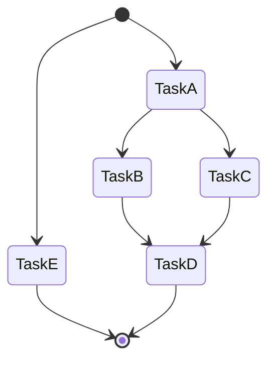

# Task Graph Solver
The Task Graph Solver Package is a PHP library that provides a mechanism for resolving dependencies between tasks represented as a directed acyclic graph (DAG).

It helps you manage and execute tasks that are dependent on each other and ensures that the tasks are executed in the correct order to resolve their dependencies.

## Installation
You can install this package using Composer:

```bash
composer require netlogix/task-graph-solver
```

## Components

### Task
You can use the simple [`Task`](src/Task.php) implementation or create your own task based on the [`TaskInterface`](src/TaskInterface.php).

If you want to execute a task multiple times, you can implement the [`ResettableTaskInterface`](src/ResettableTaskInterface.php) and reset the task to its initial state using the `reset()` method.

### TaskPool
Tasks are managed by a TaskPool, you can use the bas [`TaskPool`](src/TaskPool.php) implementation or create your own TaskPool based on the [`TaskPoolInterface`](src/TaskPoolInterface.php).
The TaskPool is responsible for storing and providing access to your defined tasks.

### TaskGraph
The TaskGraph class is used to resolve the task dependencies. It takes a TaskPool as input and can be iterated to get the tasks in the correct resolution order, considering their dependencies. It also checks for cyclic dependencies and prevents infinite loops.


## Usage

```php
use Netlogix\DependencyResolver\TaskGraph;

$taskGraph = new TaskGraph($taskPool);

foreach ($taskGraph as $resolutionBatch) {
        foreach ($resolutionBatch as $task) {
        // Execute the task or do any necessary operations.
        $task->resolve();
    }
}
```

### Resetting Tasks
If your TaskPool implements the ResettableTaskPoolInterface, you can reset all tasks to their initial state for re-execution using the resetPool() method of the TaskGraph:

```php
$taskGraph->resetPool();
```

## Example

Here is a simple example that shows how to use the TaskGraph to resolve the dependencies between tasks and generate a [mermaid](https://mermaid.js.org/) state diagram.

```php
<?php

require_once __DIR__ . '/vendor/autoload.php';

use Netlogix\DependencyResolver\Task;
use Netlogix\DependencyResolver\TaskPool;
use Netlogix\DependencyResolver\TaskGraph;

$graph = new TaskGraph(
    new TaskPool([
        new Task('TaskA'),
        new Task('TaskB', ['TaskA']),
        new Task('TaskC', ['TaskA']),
        new Task('TaskD', ['TaskB', 'TaskC']),
        new Task('TaskE'),
    ])
);

$first=true;
$lines = ['stateDiagram'];
$lastTasks = [];
foreach ($graph->getIterator() as $tasks) {
    foreach ($tasks as $name => $task) {
        $lastTasks = array_filter($lastTasks, fn($t) => !in_array($t, $task->getDependencies()));
        array_push($lines, ...$first ? ["  [*] --> $name"]
            : array_map(fn($t) => "  $t --> $name", $task->getDependencies()));
        $lastTasks[$name] = $name;
        $task->resolve();
    }
    $first=false;
}
foreach ($lastTasks as $lastTask) {
    $lines[] = "  $lastTask --> [*]";
}

echo implode("\n", $lines) . "\n";
```

**Result:**


